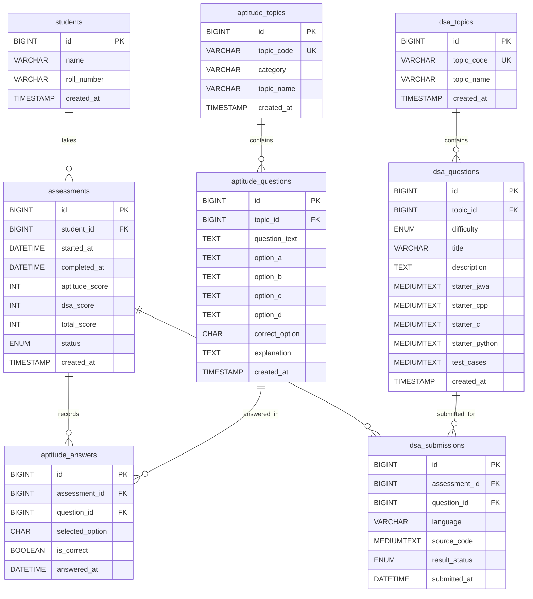

# RemotePrep Database Design & Setup Guide

This directory contains the database design scripts, schema definitions, and seed data for the **RemotePrep** Offline Assessment Portal.

---

## 1. Database Purpose

The `remoteprep` database is a normalized relational database designed in **MySQL 8.x** to:
1. Store candidate identity (`students`).
2. Manage normalized syllabus catalogs for Aptitude (`aptitude_topics`) and DSA (`dsa_topics`).
3. Store categorized questions for Aptitude (`aptitude_questions`) and multi-language DSA coding problems (`dsa_questions`).
4. Record student assessment sessions (`assessments`).
5. Persist student responses to individual aptitude questions (`aptitude_answers`) and DSA code submissions (`dsa_submissions`).

---

## 2. Entity-Relationship (ER) Diagram



---

## 3. Detailed Table Dictionary

### 1. `students`
Stores student identity.
* **`id`** (BIGINT, PK, AUTO_INCREMENT): Unique identifier.
* **`name`** (VARCHAR(100), NOT NULL): Candidate's full name.
* **`roll_number`** (VARCHAR(50), NOT NULL, INDEX): Roll/Registration number.
* **`created_at`** (TIMESTAMP): Timestamp of registration.

### 2. `aptitude_topics`
Stores the 32 normalized Aptitude syllabus topics.
* **`id`** (BIGINT, PK, AUTO_INCREMENT): Topic ID.
* **`topic_code`** (VARCHAR(50), UNIQUE, NOT NULL): Immutable string slug (e.g. `quant_percentages`, `logical_syllogism`).
* **`category`** (VARCHAR(50), NOT NULL): Category name (`Quantitative Aptitude`, `Logical Reasoning`, `Verbal Ability`, `Data Interpretation`).
* **`topic_name`** (VARCHAR(100), NOT NULL): Display topic title.
* **`created_at`** (TIMESTAMP): Creation timestamp.

### 3. `aptitude_questions`
Stores multiple-choice questions linked to specific topics.
* **`id`** (BIGINT, PK, AUTO_INCREMENT): Question ID.
* **`topic_id`** (BIGINT, FK -> `aptitude_topics.id`): Associated topic.
* **`question_text`** (TEXT, NOT NULL): Question stem.
* **`option_a`**, **`option_b`**, **`option_c`**, **`option_d`** (TEXT, NOT NULL): The 4 options.
* **`correct_option`** (CHAR(1), NOT NULL): Correct answer key ('A', 'B', 'C', or 'D').
* **`explanation`** (TEXT, NULL): Detailed solution explanation.
* **`created_at`** (TIMESTAMP): Creation timestamp.

### 4. `dsa_topics`
Stores the 10 normalized DSA syllabus topics.
* **`id`** (BIGINT, PK, AUTO_INCREMENT): Topic ID.
* **`topic_code`** (VARCHAR(50), UNIQUE, NOT NULL): Immutable string slug (e.g. `dsa_arrays`, `dsa_strings`).
* **`topic_name`** (VARCHAR(100), NOT NULL): Display topic name.
* **`created_at`** (TIMESTAMP): Creation timestamp.

### 5. `dsa_questions`
Stores DSA coding problems across difficulty tiers.
* **`id`** (BIGINT, PK, AUTO_INCREMENT): Question ID.
* **`topic_id`** (BIGINT, FK -> `dsa_topics.id`): Associated topic.
* **`difficulty`** (ENUM('EASY', 'MEDIUM', 'HARD'), NOT NULL): Difficulty classification.
* **`title`** (VARCHAR(200), NOT NULL): Problem title.
* **`description`** (TEXT, NOT NULL): Detailed problem prompt.
* **`examples`** (TEXT, NULL): Formatted input/output examples.
* **`constraints`** (TEXT, NULL): Input constraints.
* **`starter_java`**, **`starter_cpp`**, **`starter_c`**, **`starter_python`** (MEDIUMTEXT, NULL): Boilerplate code templates.
* **`test_cases`** (MEDIUMTEXT, NULL): JSON/serialized sample and hidden test suites.
* **`created_at`** (TIMESTAMP): Creation timestamp.

### 6. `assessments`
Tracks individual examination sessions for a student.
* **`id`** (BIGINT, PK, AUTO_INCREMENT): Assessment attempt ID.
* **`student_id`** (BIGINT, FK -> `students.id`): Candidate reference.
* **`started_at`** (DATETIME, NOT NULL): Examination start time.
* **`completed_at`** (DATETIME, NULL): Examination completion time.
* **`aptitude_score`** (INT, DEFAULT 0): Correct aptitude answers count.
* **`dsa_score`** (INT, DEFAULT 0): Passed DSA problems count.
* **`total_score`** (INT, DEFAULT 0): Final aggregated score.
* **`status`** (ENUM('IN_PROGRESS', 'COMPLETED', 'ABANDONED'), DEFAULT 'IN_PROGRESS'): Assessment lifecycle state.
* **`created_at`** (TIMESTAMP): Record creation timestamp.

### 7. `aptitude_answers`
Stores student answers for each aptitude question presented.
* **`id`** (BIGINT, PK, AUTO_INCREMENT): Answer record ID.
* **`assessment_id`** (BIGINT, FK -> `assessments.id` ON DELETE CASCADE): Assessment reference.
* **`question_id`** (BIGINT, FK -> `aptitude_questions.id`): Question reference.
* **`selected_option`** (CHAR(1), NULL): Selected choice ('A', 'B', 'C', 'D', or NULL if skipped).
* **`is_correct`** (BOOLEAN, DEFAULT FALSE): Evaluation indicator.
* **`answered_at`** (DATETIME, NULL): Timestamp when question was answered.

### 8. `dsa_submissions`
Stores candidate code submissions for DSA problems.
* **`id`** (BIGINT, PK, AUTO_INCREMENT): Submission record ID.
* **`assessment_id`** (BIGINT, FK -> `assessments.id` ON DELETE CASCADE): Assessment reference.
* **`question_id`** (BIGINT, FK -> `dsa_questions.id`): Question reference.
* **`language`** (VARCHAR(20), NOT NULL): Programming language used ('java', 'cpp', 'c', 'python').
* **`source_code`** (MEDIUMTEXT, NOT NULL): Complete code submitted by candidate.
* **`result_status`** (ENUM('ACCEPTED', 'WRONG_ANSWER', 'COMPILATION_ERROR', 'RUNTIME_ERROR', 'TIME_LIMIT_EXCEEDED', 'UNATTEMPTED'), NOT NULL): Verification verdict.
* **`submitted_at`** (DATETIME, NOT NULL): Submission timestamp.

---

## 4. Key Architectural Decisions

### A. Why Topics and Questions are Separated (Normalization)
* Avoids data redundancy: Topic names, category headers, and display metadata are stored once in `aptitude_topics` and `dsa_topics`, rather than duplicated across hundreds of questions.
* Enables efficient filtering: Topics can be selected by candidates and queried with simple joins on indexed foreign keys.

### B. Why Answers and Submissions are Stored Separately
* The question bank (`aptitude_questions` and `dsa_questions`) is static and reusable across thousands of assessments.
* Student attempts (`aptitude_answers` and `dsa_submissions`) are dynamic, transaction-level records associated with a specific `assessment_id`.
* This separation preserves full auditability (e.g. reviewing what code a student wrote 3 months ago) without mutating the core question bank.

### C. How Random Question Selection is Supported
When a candidate selects $N$ topics:
1. The backend determines the required quota per topic (e.g., 20 questions total for Aptitude: $10 + 10$ for 2 topics, $7 + 7 + 6$ for 3 topics).
2. The backend queries `aptitude_questions` filtered by `topic_id` using SQL randomization:
   ```sql
   SELECT * FROM aptitude_questions 
   WHERE topic_id = ? 
   ORDER BY RAND() 
   LIMIT ?;
   ```
3. For DSA, 1 EASY problem and 1 MEDIUM problem are selected from the selected topics:
   ```sql
   SELECT * FROM dsa_questions 
   WHERE topic_id IN (?) AND difficulty = 'EASY' 
   ORDER BY RAND() 
   LIMIT 1;
   ```

---

## 5. How to Execute Manually in MySQL

> **IMPORTANT**: Never hardcode database passwords in scripts or commit credentials to Git.

### Step 1: Open MySQL Command Line Client / Terminal
Open PowerShell or your terminal:
```bash
mysql -u root -p
```
*(Enter your MySQL root password when prompted)*

### Step 2: Execute Schema Script
Run the `schema.sql` script:
```sql
SOURCE d:/projects cse/backend/database/schema.sql;
```
*(Or `\. d:/projects cse/backend/database/schema.sql;`)*

### Step 3: Execute Seed Script
Run the `seed.sql` script to populate topics:
```sql
SOURCE d:/projects cse/backend/database/seed.sql;
```

### Step 4: Verify Tables and Row Counts
Run these verification queries inside MySQL:
```sql
USE remoteprep;

SHOW TABLES;

SELECT category, COUNT(*) AS total_topics 
FROM aptitude_topics 
GROUP BY category;

SELECT COUNT(*) AS total_aptitude_topics FROM aptitude_topics;
-- Expected output: 32

SELECT COUNT(*) AS total_dsa_topics FROM dsa_topics;
-- Expected output: 10
```
